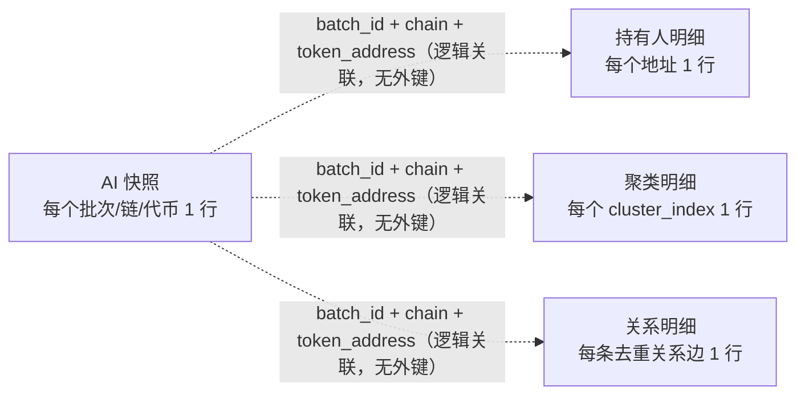

# Bubblemaps 数据与结构基线

生成时间：2026-07-21（数据库时区：UTC）

数据源：PostgreSQL `nextalpha.public`，只读查询。

## 1. 范围

本基线只覆盖当前测试范围内的 4 张表：

1. `bubblemaps_token_holder`
2. `bubblemaps_token_cluster`
3. `bubblemaps_token_relationship`
4. `bubblemaps_token_ai_snapshot`

`bubblemaps_token` 不在本次测试范围内，不参与统计和一致性判断。

## 2. 四表关系

四张表没有数据库外键，依靠以下逻辑键关联：

```text
(batch_id, chain, token_address)
```

`batch_id` 不能单独作为代币级关联键，因为一个批次可以包含多个链和代币。



各表唯一键：

| 表 | 唯一键 |
| --- | --- |
| `bubblemaps_token_ai_snapshot` | `(batch_id, chain, token_address)` |
| `bubblemaps_token_holder` | `(batch_id, chain, token_address, address)` |
| `bubblemaps_token_cluster` | `(batch_id, chain, token_address, cluster_index)` |
| `bubblemaps_token_relationship` | `(batch_id, chain, token_address, relation_scope, from_address, to_address, rel_type)` |

## 3. 实时数据概况

### 3.1 表级规模

| 表 | 行数 | 批次数 | 不同 `chain + token_address` | 最早写入（UTC） | 最近写入（UTC） | 总占用约 |
| --- | ---: | ---: | ---: | --- | --- | ---: |
| `bubblemaps_token_holder` | 11,600 | 9 | 86 | 2026-07-13 10:06:18 | 2026-07-21 01:30:11 | 12.91 MiB |
| `bubblemaps_token_cluster` | 365 | 9 | 80 | 2026-07-13 10:06:18 | 2026-07-21 01:30:11 | 0.51 MiB |
| `bubblemaps_token_relationship` | 5,363 | 9 | 86 | 2026-07-13 10:06:18 | 2026-07-21 01:30:11 | 7.35 MiB |
| `bubblemaps_token_ai_snapshot` | 143 | 7 | 86 | 2026-07-13 11:44:11 | 2026-07-21 01:30:11 | 17.15 MiB |

AI 快照包含：

- 51 个非空代币符号（另有 1 行 `token_symbol IS NULL`）
- 84 个不同的原始 `token_address`
- 86 个不同的 `chain + token_address`
- 10 条链
- 141 个完整快照、2 个部分成功快照
- 全部使用 `snapshot_version = 'v1'`、`data_source = 'bubblemaps'`

### 3.2 链分布

| chain | AI 快照 | 持有人明细 | 聚类明细 | 关系明细 |
| --- | ---: | ---: | ---: | ---: |
| `eth` | 59 | 4,880 | 156 | 1,869 |
| `bsc` | 47 | 3,760 | 111 | 1,985 |
| `base` | 14 | 1,120 | 34 | 373 |
| `arbitrum` | 8 | 640 | 12 | 231 |
| `solana` | 7 | 560 | 21 | 323 |
| `avalanche` | 2 | 160 | 2 | 74 |
| `polygon` | 2 | 160 | 9 | 137 |
| `tron` | 2 | 160 | 12 | 163 |
| `sonic` | 1 | 80 | 4 | 19 |
| `ton` | 1 | 80 | 4 | 189 |

### 3.3 批次演进

| 时间（UTC） | 批次特征 | holder | cluster | relationship | snapshot | 备注 |
| --- | --- | ---: | ---: | ---: | ---: | --- |
| 2026-07-13 10:06 | 单代币早期批次 | 80 | 3 | 28 | 0 | 只有三张明细表 |
| 2026-07-13 11:15 | 单代币早期批次 | 80 | 3 | 28 | 0 | 只有三张明细表 |
| 2026-07-13 11:44 至 2026-07-15 08:22 | 4 个单代币批次 | 每批 80 | 每批 1 至 4 | 每批 23 至 30 | 每批 1 | 早期功能验证数据 |
| 2026-07-15 08:38 至 09:06 | 首个全量批次 | 6,880 | 208 | 3,196 | 86 | 86 个链上代币范围 |
| 2026-07-20 03:18 至 03:38 | 增量批次 | 4,160 | 135 | 1,956 | 52 | 含 2 个部分成功快照 |
| 2026-07-21 01:30 | USDC/ETH 单代币批次 | 80 | 4 | 44 | 1 | 快照原始关系数为 54 |

只有明细、没有 AI 快照的两个批次：

| batch_id | chain | 写入时间（UTC） |
| --- | --- | --- |
| `4492d13f-d802-42cd-b8ff-3fc6b0d6bda2` | `eth` | 2026-07-13 10:06:18 |
| `c32cd83a-5346-4a51-a5c5-f4abefd04a2c` | `eth` | 2026-07-13 11:15:58 |

## 4. 表结构

### 4.1 `bubblemaps_token_holder`

用途：保存每个采集批次中的头部持有人明细，一行对应一个地址。

字段数：23。

| 分类 | 字段及类型 |
| --- | --- |
| 主键与逻辑键 | `id BIGSERIAL PK`；`batch_id UUID NOT NULL`；`chain VARCHAR(32) NOT NULL`；`token_address TEXT NOT NULL`；`address TEXT NOT NULL` |
| 来源 | `data_source VARCHAR(64) NOT NULL`；`data_tags TEXT[] NOT NULL DEFAULT []` |
| 身份与排名 | `label VARCHAR(255)`；`rank BIGINT`；`entity_id VARCHAR(255)` |
| 持仓 | `amount NUMERIC(38,18)`；`share NUMERIC(18,10)`；`share_percent NUMERIC(12,4)` |
| 地址特征 | `is_contract BOOLEAN`；`is_cex BOOLEAN`；`is_dex BOOLEAN`；`is_supernode BOOLEAN`；`degree BIGINT` |
| 关系统计 | `inward_relations BIGINT`；`outward_relations BIGINT` |
| 时间与原始数据 | `first_activity_date TIMESTAMPTZ`；`raw_data JSONB`；`created_at TIMESTAMPTZ NOT NULL DEFAULT CURRENT_TIMESTAMP` |

约束和索引：

- 主键：`id`
- 唯一约束：`(batch_id, chain, token_address, address)`
- 普通索引：`idx_bubblemaps_token_holder_chain_address (chain, token_address, address)`

当前字段覆盖情况：

- `amount`、`share`、`share_percent`、`rank`、`raw_data` 均无空值。
- 5,558 行有非空标签。
- 2,630 行标记为 CEX，1,816 行标记为合约地址。
- `rank` 范围为 1 至 80。

### 4.2 `bubblemaps_token_cluster`

用途：保存地址聚类，一行对应一个聚类序号。

字段数：14。

| 分类 | 字段及类型 |
| --- | --- |
| 主键与逻辑键 | `id BIGSERIAL PK`；`batch_id UUID NOT NULL`；`chain VARCHAR(32) NOT NULL`；`token_address TEXT NOT NULL`；`cluster_index INTEGER NOT NULL` |
| 来源 | `data_source VARCHAR(64) NOT NULL`；`data_tags TEXT[] NOT NULL DEFAULT []` |
| 聚类指标 | `share NUMERIC(18,10)`；`share_percent NUMERIC(12,4)`；`amount NUMERIC(38,18)`；`holder_count BIGINT` |
| 聚类内容 | `holders JSONB`；`raw_data JSONB` |
| 时间 | `created_at TIMESTAMPTZ NOT NULL DEFAULT CURRENT_TIMESTAMP` |

约束和索引：

- 主键：`id`
- 唯一约束：`(batch_id, chain, token_address, cluster_index)`
- 除主键和唯一约束自动索引外，没有额外普通索引。

当前字段覆盖情况：

- 365 行的 `share`、`share_percent`、`amount`、`holder_count`、`holders`、`raw_data` 均无空值。
- `cluster_index` 范围为 1 至 7。
- 单个聚类的 `holder_count` 范围为 2 至 76。

### 4.3 `bubblemaps_token_relationship`

用途：保存去重后的地址关系边；关系来源范围由 `relation_scope` 区分。

字段数：19。

| 分类 | 字段及类型 |
| --- | --- |
| 主键与逻辑键 | `id BIGSERIAL PK`；`batch_id UUID NOT NULL`；`chain VARCHAR(32) NOT NULL`；`token_address TEXT NOT NULL` |
| 关系键 | `relation_scope VARCHAR(32) NOT NULL`；`from_address TEXT NOT NULL`；`to_address TEXT NOT NULL`；`rel_type VARCHAR(64)` |
| 来源 | `data_source VARCHAR(64) NOT NULL`；`data_tags TEXT[] NOT NULL DEFAULT []` |
| 关系指标 | `total_value NUMERIC(38,18)`；`total_transfers BIGINT` |
| 时间 | `first_date BIGINT`；`first_date_at TIMESTAMPTZ`；`last_date BIGINT`；`last_date_at TIMESTAMPTZ` |
| 上下文和原始数据 | `token_key JSONB`；`raw_data JSONB`；`created_at TIMESTAMPTZ NOT NULL DEFAULT CURRENT_TIMESTAMP` |

约束和索引：

- 主键：`id`
- 唯一约束：`(batch_id, chain, token_address, relation_scope, from_address, to_address, rel_type)`
- 普通索引：`idx_bubblemaps_relationship_chain_address (chain, token_address, relation_scope)`

当前分类：

| 字段 | 值 | 行数 |
| --- | --- | ---: |
| `relation_scope` | `map` | 5,036 |
| `relation_scope` | `top10_subgraph` | 327 |
| `rel_type` | `GROUPED_TRANSFER` | 5,363 |

当前字段覆盖情况：

- 关系指标、双份时间字段和 `raw_data` 均无空值。
- `first_date`、`last_date` 为 Unix 毫秒时间戳。
- 5,363 行的毫秒时间戳与对应 `TIMESTAMPTZ` 全部一致。

### 4.4 `bubblemaps_token_ai_snapshot`

用途：面向下游和 AI 的代币级聚合快照；一行汇总一个批次、链和代币的持有人、聚类、关系、评分和采集状态。

字段数：50。

| 分类 | 字段及类型 |
| --- | --- |
| 主键与逻辑键 | `id BIGSERIAL PK`；`batch_id UUID NOT NULL`；`chain VARCHAR(32) NOT NULL`；`token_address TEXT NOT NULL` |
| 来源与标签 | `data_source VARCHAR(64) NOT NULL`；`source_label VARCHAR(128) NOT NULL DEFAULT 'bubblemaps'`；`data_tags TEXT[] NOT NULL DEFAULT []`；`chain_label VARCHAR(64) NOT NULL DEFAULT ''`；`token_labels TEXT[] NOT NULL DEFAULT []` |
| 查询与代币身份 | `query_text VARCHAR(255)`；`preferred_chain VARCHAR(32)`；`token_name VARCHAR(255)`；`token_symbol VARCHAR(64)`；`is_indexed BOOLEAN`；`image_url TEXT` |
| 活跃度 | `transfers_count BIGINT`；`first_transfer_at TIMESTAMPTZ`；`last_transfer_at TIMESTAMPTZ`；`holder_count BIGINT` |
| 集中度与评分 | `top_10_holder_share_percent NUMERIC(12,4)`；`bubblemaps_score NUMERIC(12,4)`；`gini_index NUMERIC(12,6)`；`herfindahl_hirschman_index NUMERIC(12,6)`；`nakamoto_coefficient BIGINT` |
| 上游更新时间 | `dt_update TIMESTAMPTZ`；`ts_update BIGINT` |
| 上游聚合结构 | `supply_stats JSONB`；`scores JSONB` |
| AI 聚合数组 | `top_holders JSONB NOT NULL DEFAULT []`；`clusters JSONB NOT NULL DEFAULT []`；`relationships JSONB NOT NULL DEFAULT []`；`address_metadata JSONB NOT NULL DEFAULT []` |
| 采集状态 | `collection_step_status JSONB`；`partial_errors JSONB NOT NULL DEFAULT []`；`is_partial BOOLEAN NOT NULL DEFAULT FALSE`；`snapshot_version VARCHAR(32) NOT NULL DEFAULT 'v1'` |
| 聚合计数 | `top_holder_count BIGINT NOT NULL DEFAULT 0`；`cluster_count BIGINT NOT NULL DEFAULT 0`；`relationship_count BIGINT NOT NULL DEFAULT 0`；`labeled_holder_count BIGINT NOT NULL DEFAULT 0`；`cex_holder_count BIGINT NOT NULL DEFAULT 0`；`contract_holder_count BIGINT NOT NULL DEFAULT 0`；`partial_step_count BIGINT NOT NULL DEFAULT 0` |
| 分级摘要 | `holder_concentration_level VARCHAR(32)`；`relationship_density_level VARCHAR(32)`；`cluster_concentration_level VARCHAR(32)`；`analysis_ready_text TEXT` |
| 解析与原始载荷 | `resolution JSONB`；`raw_payload JSONB`；`created_at TIMESTAMPTZ NOT NULL DEFAULT CURRENT_TIMESTAMP` |

约束和索引：

- 主键：`id`
- 唯一约束：`(batch_id, chain, token_address)`
- 普通索引：`idx_bubblemaps_ai_snapshot_chain_address (chain, token_address)`

当前字段覆盖情况：

- `holder_count`、`bubblemaps_score`、`analysis_ready_text`、`raw_payload`、`resolution`、`collection_step_status` 均无空值。
- `top_holders`、`clusters`、`relationships`、`address_metadata` 全部为 JSON 数组。
- 只有 1 行 `token_symbol IS NULL`。

## 5. 关键数据口径

### 5.1 持有人和聚类计数

对全部 143 个快照：

- `top_holder_count` 与 holder 明细行数一致。
- `cluster_count` 与 cluster 明细行数一致。
- `labeled_holder_count`、`cex_holder_count`、`contract_holder_count` 与 holder 明细重新聚合的结果一致。
- `top_holders`、`clusters` JSON 数组长度与各自计数字段一致。

`holder_count` 是上游返回的代币持有人总数，不应拿来与当前只保存头部地址的 holder 明细行数比较；应使用 `top_holder_count`。

### 5.2 关系计数

`relationship_count` 的口径不是关系明细表行数，而是 `relationships` JSON 中合并后的原始条目数。JSON 中允许同一逻辑边重复出现。

当前数据：

| 指标 | 数量 |
| --- | ---: |
| 快照 JSON 原始关系条目 | 14,364 |
| 按 `from_address + to_address + rel_type` 去重后的 JSON 关系 | 5,294 |
| 有快照批次中的去重关系明细 | 5,294 |
| JSON 重复条目 | 9,070 |

结论：

- 143 个快照的 `relationship_count` 均与 JSON 原始数组长度一致。
- 137 个快照的 `relationship_count` 与关系明细行数不相等，这是原始条目与去重边的口径差异。
- 对每一个快照，JSON 去重后的关系集合与关系明细集合一致，没有发现 JSON 关系落表丢失。
- 全表关系明细比上述 5,294 条多 56 条，全部来自两个没有 AI 快照的早期批次。

后续核对关系明细时，应比较去重集合，不应直接比较 `relationship_count = COUNT(*)`。

### 5.3 部分成功状态

`partial_step_count` 统计跳过或失败的采集步骤；`is_partial` 只在存在失败步骤时为真。因此 `partial_step_count > 0` 不等价于 `is_partial = TRUE`。

固定跳过情况：

- `address_metadata`：143/143 个快照均因权限不可用而跳过，但步骤标记为成功。
- `metadata`：140/143 个快照因请求被禁用、改用本地代币引用而跳过；另 3 个正常执行。

真正的部分成功快照共 2 个：

| chain | token | 失败步骤 | 原因 |
| --- | --- | --- | --- |
| `eth` | `TLM` | `subgraph_relationships` | 读取超时 |
| `bsc` | `UNI` | `map_data` | 读取超时 |

## 6. 后续验证基准

以下现象已经确认存在，但本基线不先判定为缺陷：

1. 两个 2026-07-13 的早期批次只有三张明细表，没有 AI 快照。
2. 关系快照保留原始重复边，关系明细按键去重，两个计数口径不同。
3. 所有快照的 `partial_step_count` 都大于 0，原因是固定跳过步骤；只有 2 个快照的 `is_partial` 为真。
4. 有 1 个快照缺少 `token_symbol`。
5. 数据库没有四表之间的外键，跨表完整性必须通过查询验证。

后续验证建议始终明确两种查询范围：

- **历史批次验证**：使用完整 `(batch_id, chain, token_address)`。
- **当前代币状态**：按 `(chain, token_address)` 对 `created_at DESC, id DESC` 排序，只取最新快照。

获取每个链上代币最新快照的基准 SQL：

```sql
SELECT *
FROM (
    SELECT
        s.*,
        ROW_NUMBER() OVER (
            PARTITION BY chain, token_address
            ORDER BY created_at DESC, id DESC
        ) AS rn
    FROM public.bubblemaps_token_ai_snapshot AS s
) AS ranked
WHERE rn = 1;
```

跨表计数应使用同一个三字段逻辑键，不要只按 `batch_id` 或 `token_address` 连接。
