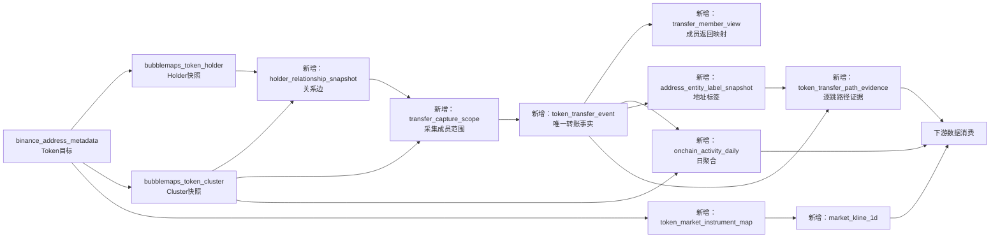

# Bubblemaps 补充数据接入需求

> 交付对象：数据中台
> 文档日期：2026-07-31
> 目标：在复用现有 PostgreSQL Holder/Cluster 快照的基础上，补齐链上关系、逐笔转账、采集覆盖、日频聚合和市场日 K 数据，形成可追溯、可增量的数据服务。

## 1. 结论摘要

现有 PostgreSQL 已经保存：

1. 币种、链、合约地址和启用状态；
2. Bubblemaps ranked holder 快照；
3. Bubblemaps Cluster 快照、余额、占比和成员集合。

现有 PostgreSQL 尚未保存：

1. ranked holder 之间的 Subgraph 关系边；
2. Cluster 普通成员涉及的逐笔 Token Transfer；
3. 转账的交易哈希、时间、方向、金额和外部对手地址；
4. 基于逐笔转账聚合的每日活跃地址、新地址、最大单笔和净流；
5. 用于联合分析的 Binance 日 K、成交量及市场标识；
6. 外部地址的实体标签，以及巨额转账经过中转地址后最终进入交易所、DEX、Bridge或项目合约的路径证据。

因此本次中台建设重点不是重复建设 Holder/Cluster，而是补充以下事实数据：

| 优先级 | 建议数据集 | 作用 |
|---|---|---|
| P0 | Holder关系边快照 | 保存Cluster形成依据及地址间聚合关系 |
| P0 | Token逐笔转账事实 | 保存可去重、可追溯的链上事件 |
| P0 | Transfer采集成员映射与覆盖状态 | 去重、审计缺失成员、识别Supernode缺口 |
| P0 | Binance日K事实 | 补充价格和成交量时间序列 |
| P1 | Token链上日聚合 | 固化每日金额、笔数、地址数、最大单笔和净流，供下游统一消费 |
| P1 | 地址实体标签快照 | 标识交易所、DEX、Bridge、Staking、Vesting、多签及项目合约 |
| P1 | Token转账路径证据 | 保存巨额转账从Cluster流出后多跳到达的最终去向和逐跳证据 |

## 2. 现有 PostgreSQL 数据

### 2.1 `public.binance_address_metadata`

当前项目实际使用字段：

| 字段 | 用途 |
|---|---|
| `token_symbol` | 币种筛选和展示 |
| `chain` | 网络标识 |
| `token_address` | Token合约地址 |
| `is_active` | 是否进入采集目标 |

当前目标选择规则：

- `is_active = 1`；
- `token_address` 非空；
- 链在项目支持列表内；
- 使用 `chain + token_address` 作为Token目标身份，不使用Symbol作为唯一键。

### 2.2 `public.bubblemaps_token_holder`

该表是按 `batch_id + chain + token_address + created_at` 保存的 Holder 快照。

已有字段包括：

- Holder地址、rank；
- Token余额、持仓比例；
- label、entity_id、data_source、data_tags；
- `is_contract`、`is_cex`、`is_dex`、`is_supernode`；
- degree、inward_relations、outward_relations；
- first_activity_date；
- batch_id、created_at。

注意：

- 这是抓取时点的持仓截面，不是逐笔转账事实；
- `degree` 不能替代某日活跃地址数；
- `first_activity_date` 不能替代“在本地可见Transfer集合中的首次出现日期”。

### 2.3 `public.bubblemaps_token_cluster`

该表保存对应批次的Cluster快照。

已有字段包括：

- cluster_index；
- Cluster余额、持仓比例；
- holder_count；
- holders地址数组；
- batch_id、chain、token_address、created_at；
- data_source、data_tags。

该表可以提供：

- 当前Cluster成员集合；
- Cluster合计余额；
- 成员内外判断及规模归一化所需的Cluster余额。

该表不能提供：

- 成员为什么被连接在同一Cluster中的关系边；
- Cluster成员历史上发生的逐笔转账；
- Cluster与外部地址之间的资金/Token流向。

### 2.4 补充数据缺口总表

| 数据 | PG现状 | 获取/生成方法 | 与原有数据的关联 |
|---|---|---|---|
| 两地址之间的具体关系边 | 没有 | Bubblemaps Subgraph API | 同批Holder的 `batch_id + chain + token_address + from/to_address` |
| 地址A向地址B累计转多少 | 没有 | Subgraph聚合边的total_value/total_transfers | 两端地址必须存在于同批Holder |
| 每条转账的交易哈希 | 没有 | Bubblemaps Transfers API；生产建议链节点/索引器 | `chain + token_address` 关联Token，member view关联Cluster成员 |
| 每条转账的时间戳 | 没有 | Transfers API的date；链源使用block timestamp | 转换成UTC event_at和event_date |
| 每条转账的金额 | 没有 | Transfers API的value；链源使用Transfer event value | 使用numeric；Token身份由chain+token_address确定 |
| Cluster成员与外部地址的转账 | 没有 | 保留Transfer完整from/to，不过滤外部对手 | 用同批Cluster成员集合判断内外部 |
| 外部对手地址 | 没有 | 从Transfer另一端地址取得 | 可以后续关联地址标签维表，不能要求其属于ranked holder |
| 每日活跃地址 | 没有 | 按UTC日去重from/to地址 | 从去重后的Transfer事实聚合 |
| 每日新增地址 | 没有 | 计算地址在本地可见Transfer历史中的first_seen | 口径不是钱包创建时间 |
| 单日最大转账 | 没有 | 每日 `MAX(amount)` | 可与现有Cluster amount联合使用 |
| 单日净流入/净流出 | 没有 | 根据成员/外部方向分别求和 | 使用现有Cluster成员集合判断流向 |
| K线、成交量、价格 | Bubblemaps表没有 | Binance USDⓈ-M Futures 1d；也可补Spot | 通过Token—市场标识映射关联，禁止只按Symbol |
| 地址属于哪个实体/类型 | 只有部分Holder标签，外部地址不完整 | 正式地址标签服务；PoC可从已登录Arkham网页只读采集 | 通过 `chain + address` 关联Transfer的from/to |
| 巨额转账最终是否进入交易所 | 没有 | 从Cluster外流事件开始，按Token Transfer逐跳追踪并关联地址标签 | 起点关联 `token_transfer_event`，逐跳保存证据event_id |

## 3. 需要补充的数据及获取方法

### 3.1 两地址之间的具体关系边

**当前PG状态：没有完整Subgraph边。**

建议来源：

- 当前项目PoC来源：Bubblemaps `/relationships/subgraph`；
- 请求输入：同一 `chain + token_address` 下的 ranked holder 地址列表；
- 返回后只保留：
  - Token引用与目标完全一致；
  - `rel_type = GROUPED_TRANSFER`；
  - 起止地址均属于同一批 ranked holder。

需要保存：

- from_address、to_address；
- rel_type；
- total_value；
- total_transfers；
- first_date、last_date；
- 对应Holder/Cluster的batch_id；
- API采集时间、数据源和原始JSON。

### 3.2 地址A向地址B累计转账

**当前PG状态：Cluster表只有成员集合，没有地址对的累计关系。**

获取方式与3.1一致，来自Subgraph聚合边。

该数据只适合：

- 重建Cluster；
- 展示地址间聚合关系；
- 观察关系强度和关系存在时间。

不能替代逐笔转账，因为聚合边无法准确恢复每一日的金额、笔数和路径顺序。

### 3.3 每条Token转账

**当前PG状态：没有逐笔Transfer事实。**

当前项目PoC获取方式：

1. 根据Holder关系边重建Cluster；
2. 获取所有非Supernode的普通Cluster成员；
3. 对每个成员调用 Bubblemaps `/relationships/transfers`；
4. 限定精确的 `chain + token_address`；
5. 只保留该成员位于 `from_address` 或 `to_address` 任一端的正式 `TRANSFER`。

每条记录至少需要：

- chain、token_address；
- tx_hash；
- from_address、to_address；
- amount；
- event_timestamp_ms / event_at；
- source；
- 原始JSON。

生产建议：

- Bubblemaps Transfer适合作为当前成员范围内的快速补充源；
- 若要求完整、长期、可重放的Token Transfer事实，优先使用链节点、归档节点或正式链上索引服务；
- EVM链建议保存 `block_number + transaction_hash + log_index`；
- Solana、TON、Tron等链需要各自的事件唯一标识适配；
- Bubblemaps API当前没有稳定暴露统一的 `log_index`，必须保留后述的fallback fingerprint。

### 3.4 Cluster成员与外部地址的转账、外部对手地址

**当前PG状态：没有。**

获取方法：

- 从逐笔Transfer中保留完整from/to地址；
- 不要求外部对手地址也是ranked holder；
- 以目标时点的Cluster成员集合判断：
  - 外部 → 成员：external inflow；
  - 成员 → 外部：external outflow；
  - 成员 → 成员：Cluster内部流转，不计外部净流；
  - 外部 → 外部：不属于当前采集范围。

必须保存外部对手地址，即使没有标签；否则无法生成完整的成员内外流向数据。

### 3.5 每日活跃地址、每日新增地址

**当前PG状态：没有可直接使用的日频值。**

由逐笔Transfer派生：

- 每日活跃地址：当日Transfer中 `from_address ∪ to_address` 的去重数量；
- 每日新增地址：地址第一次出现在本地可见Transfer事实中的日期等于当日。

需要同时保存口径字段：

- `address_scope = cluster_member_visible_transfers`；
- `first_seen_basis = local_observed_transfer_history`。

“新增地址”不等于钱包创建时间，也不代表链上全局第一次活动。

### 3.6 单日最大转账、单日净流入/净流出

**当前PG状态：没有。**

由逐笔Transfer派生：

- 单日最大转账：`MAX(amount)`；
- 外部流入：外部地址转入Cluster成员的amount之和；
- 外部流出：Cluster成员转向外部地址的amount之和；
- 净流：`external_inflow - external_outflow`。

金额均为Token原始数量口径，不是美元金额，也不是交易成交量。

### 3.7 K线、成交量、价格

**当前Bubblemaps PG表状态：没有。**

当前项目来源：

- Binance USDⓈ-M Futures；
- 接口：`/fapi/v1/klines`；
- interval：`1d`；
- 当前研究使用 `SYMBOLUSDT`。

建议保存：

- exchange、market_type、instrument；
- interval、open_time、close_time；
- open、high、low、close；
- base_volume、quote_volume；
- trade_count；
- source、ingested_at。

Symbol不能直接作为Token唯一键。需要通过市场标识映射表，将：

`exchange + market_type + instrument`

映射到：

`chain + token_address`

并允许一个Symbol对应多链Token、一个Token对应多个交易市场。

### 3.8 地址实体标签

**当前PG状态：Holder表只有部分ranked holder标签，无法覆盖Transfer中出现的所有外部地址。**

地址标签至少需要区分：

- 中心化交易所及其Deposit/Hot Wallet；
- DEX、Router、LP/Pool和Vault；
- Bridge及跨链Relayer；
- Staking、Vesting、Lock、Treasury和项目合约；
- Gnosis Safe/多签；
- 普通EOA、未知鲸鱼和未知合约。

建议获取方式：

| 环境 | 获取方式 | 说明 |
|---|---|---|
| 生产主方案 | 经授权的正式地址标签API或数据供应商 | 以 `chain + address` 批量查询；保存供应商标签、实体、类别、置信度和更新时间 |
| 生产补充 | 链浏览器公开标签、项目官方地址清单、已验证合约元数据 | 需要保存来源URL、证据类型和采集时间，不能覆盖高置信度人工标签 |
| 内部维护 | 数据中台地址标签维表 | 人工复核后写入，保留版本、审核人、证据和有效期 |
| 当前PoC | 已登录Arkham网页只读采集 | 打开 `https://arkm.com/explorer/address/{address}`，读取页面实体名、Exchange Usage和Transfer对手方标签 |

Arkham网页PoC采集规则：

1. 仅访问已知待核对地址，不做全站枚举；
2. 读取地址页标题、实体标签、Exchange Usage和可见Transfer对手方标签；
3. 对每个交易所标签必须同时核对具体Token和amount；
4. 地址曾使用Binance/OKX等交易所，不代表目标Token已经入所；
5. 保存证据页面URL、采集时间、目标Token、证据交易哈希和标签原文；
6. 不保存Cookie、登录凭证、浏览器会话、JWT或网页请求敏感Header；
7. 网页自动化只用于研究PoC和人工复核，不作为生产批量主数据源。

建议采集频率：

- 新外部地址首次出现时立即查询；
- 未知地址在其发生大额转账后重新查询；
- 已有标签按7至30天TTL重查，或在关键事件发生时重查；
- 标签变化保留历史版本，不原地覆盖。

### 3.9 巨额转账后续路径

**当前PG状态：没有逐跳路径，也没有“最终进入交易所”的可审计结论。**

获取/生成流程：

1. 从Cluster成员流向外部地址的Transfer中选择起始事件；
2. 查询第一跳目标地址的实体标签；
3. 若目标地址未知，继续读取该Token从该地址转出的Transfer；
4. 在限定时间窗、最大跳数和最小金额比例内继续追踪；
5. 遇到以下已知终点时停止：
   - CEX Deposit/Hot Wallet；
   - DEX/LP/Router/Vault；
   - Bridge；
   - Staking/Vesting/Lock；
   - 项目合约、Treasury或多签；
6. 保存每一跳的event_id、from/to、amount、event_at和地址标签快照；
7. 分别计算直接入所、一跳入所、两跳入所及未知路径金额。

建议默认参数：

- `max_hops = 3`；
- `path_window_days = 30`；
- `min_path_amount_ratio = 0.01`，即小于起始金额1%的分支可以单独汇总为dust；
- 同一地址发生拆分时按Transfer事实逐分支追踪，禁止把地址全部余额直接归因给某个终点；
- 发生合并、拆分或跨链时保存路径状态，不能只存最终标签。

重要口径：

- “地址有交易所使用记录”不等于“目标Token进入交易所”；
- 只有目标Token的Transfer直接到达已标记交易所地址时，才计入入所金额；
- 转入DEX、Bridge、Gnosis Safe或项目合约必须单独分类；
- 未知地址超过最大跳数后标记为 `unresolved`，不能视为零或视为交易所。

### 3.10 接口调用清单与调用方式

本节区分三类接口：

1. **当前项目已实际调用**：Bubblemaps前端接口、Binance USDⓈ-M Futures公开行情接口；
2. **生产建议主源**：EVM/Solana链节点JSON-RPC；
3. **尚未选定供应商**：地址实体标签API。Arkham网页仅是当前PoC，不应被描述为正式API。

#### 3.10.1 Bubblemaps：当前项目已实际调用的接口

入口页：

```text
GET https://v2.bubblemaps.io/map
```

当前Bubblemaps API Host不是在本项目中硬编码的固定域名。现有客户端先读取入口页及其
`/assets/*.js` 前端资源，从中发现当前的 `VITE_API_BASE_URL`。因此下表使用
`{BUBBLEMAPS_API_BASE_URL}` 表示运行时发现的Host。

| 用途 | 方法与接口 | Query参数 | Body |
|---|---|---|---|
| Top 300 Holder | `POST {BASE}/addresses/token-top-holders` | `count=300&nocache=false` | `{"chain":"bsc","address":"0xTOKEN"}` |
| Holder关系边 | `POST {BASE}/relationships/subgraph` | `whitelist_token_address=0xTOKEN&whitelist_token_chain=bsc&queue_whitelisted_token_map=false` | ranked holder地址JSON数组 |
| 某成员相关Transfer | `GET {BASE}/relationships/transfers` | `address=0xMEMBER&whitelist_token_address=0xTOKEN&whitelist_token_chain=bsc` | 无 |

请求Header：

```http
accept: application/json
content-type: application/json
user-agent: <browser-compatible user agent>
x-validation: <5分钟有效的请求签名>
```

当前前端的 `x-validation` 是针对“路径加Query字符串”生成的短时签名。现有项目客户端会：

1. 从Bubblemaps入口页的前端资源发现API Base URL和当前validation配置；
2. 为精确的relative URL生成5分钟有效的HS256签名；
3. 遇到401时重新读取前端配置；
4. 遇到429或5xx时按限制重试；
5. 默认请求超时20秒、最多3次、接口请求最小间隔2.1秒。

这套流程属于**当前研究PoC对网站前端接口的兼容实现**，不是数据中台应长期依赖的
正式服务凭据。不得将发现到的validation值、签名、Cookie或登录态落库、提交到代码库
或写进本文档。生产接入应向Bubblemaps申请授权明确、稳定的服务端访问方式。

数据中台优先直接复用当前项目封装，避免自行复制签名逻辑：

```python
import asyncio

from getMarket.bubblemaps.tool.bubblemaps_api import BubblemapsApiClient
from getMarket.bubblemaps.tool.export_bubblemaps_market import clean_holders
from getMarket.bubblemaps.tool.market_identity import make_target


async def main() -> None:
    target = make_target("bsc", "0xTOKEN")
    client = BubblemapsApiClient(
        timeout=20,
        max_attempts=3,
        retry_delay=0.25,
        min_request_interval=2.1,
    )

    holders_result = await client.get_top_holders(target)
    holders = clean_holders(holders_result, target)
    ranked_addresses = [row["address"] for row in holders]

    subgraph_result = await client.get_subgraph(target, ranked_addresses)
    member_result = await client.get_transfers(target, ranked_addresses[0])

    # holders_result.payload：Holder原始响应
    # subgraph_result.payload：关系边原始响应
    # member_result.payload：该成员相关的Transfer原始响应


asyncio.run(main())
```

项目已有的端到端采集命令：

```bash
python -m getMarket.bubblemaps.tool.export_bubblemaps_market \
  --chain bsc \
  --token-address 0xTOKEN \
  --api-timeout 20 \
  --api-max-attempts 3 \
  --api-retry-delay 0.25 \
  --api-min-interval 2.1
```

调用顺序必须是：

```text
token-top-holders
    → 提取ranked holder地址
    → relationships/subgraph
    → 根据关系边重建普通Cluster
    → 对每个非Supernode成员调用relationships/transfers
    → Transfer事实去重
    → 写member view和capture scope
```

不能只调用某一个Holder地址的Transfers并宣称获得了Token全量流水。当前接口返回的是
“指定成员可见的Transfer集合”；成员失败、Supernode跳过和重复返回都必须单独记录。

#### 3.10.2 Binance：日K、价格和成交量

当前项目实际调用Binance USDⓈ-M Futures公开市场数据接口：

```http
GET https://fapi.binance.com/fapi/v1/klines
```

请求示例：

```bash
curl --get 'https://fapi.binance.com/fapi/v1/klines' \
  --data-urlencode 'symbol=VELVETUSDT' \
  --data-urlencode 'interval=1d' \
  --data-urlencode 'limit=1500'
```

该市场数据接口当前调用不需要API Key。中台需遵守Binance的请求权重和限流规则。
一次返回一组数组，当前项目使用的字段位置为：

| 数组位置 | 字段 | 落库字段 |
|---:|---|---|
| 0 | K线开盘时间，毫秒 | `open_time` |
| 1 | 开盘价 | `open` |
| 2 | 最高价 | `high` |
| 3 | 最低价 | `low` |
| 4 | 收盘价 | `close` |
| 5 | Base Asset成交量 | `base_volume` |
| 6 | K线收盘时间，毫秒 | `close_time` |
| 7 | Quote Asset成交量 | `quote_volume` |
| 8 | 成交笔数 | `trade_count` |

生产增量调用时应增加 `startTime`、`endTime`，并按
`exchange + market_type + instrument + interval + open_time` 幂等Upsert：

```bash
curl --get 'https://fapi.binance.com/fapi/v1/klines' \
  --data-urlencode 'symbol=VELVETUSDT' \
  --data-urlencode 'interval=1d' \
  --data-urlencode 'startTime=1767225600000' \
  --data-urlencode 'endTime=1769903999999' \
  --data-urlencode 'limit=1500'
```

接口文档：[Binance USDⓈ-M Futures Kline/Candlestick Data](https://developers.binance.com/docs/derivatives/usds-margined-futures/market-data/rest-api/Kline-Candlestick-Data)

#### 3.10.3 EVM链：生产级ERC-20 Transfer事实

适用链包括Ethereum、BSC、Base、Arbitrum、Polygon、Avalanche等EVM网络。通过节点或
归档节点JSON-RPC调用：

```http
POST {EVM_RPC_URL}
content-type: application/json
```

第一步，用 `eth_getLogs` 按区块段提取目标Token合约的ERC-20 Transfer事件：

```bash
curl -X POST "$EVM_RPC_URL" \
  -H 'content-type: application/json' \
  --data '{
    "jsonrpc":"2.0",
    "id":1,
    "method":"eth_getLogs",
    "params":[{
      "fromBlock":"0xSTART_BLOCK",
      "toBlock":"0xEND_BLOCK",
      "address":"0xTOKEN",
      "topics":[
        "0xddf252ad1be2c89b69c2b068fc378daa952ba7f163c4a11628f55a4df523b3ef"
      ]
    }]
  }'
```

其中固定Topic是 `Transfer(address,address,uint256)` 的事件签名。响应解析：

- `topics[1]`：from地址；
- `topics[2]`：to地址；
- `data`：Token raw amount；
- `blockNumber`：区块号；
- `transactionHash`：交易哈希；
- `logIndex`：同一交易内的事件序号。

第二步，对出现的新区块调用 `eth_getBlockByNumber` 获取区块时间：

```bash
curl -X POST "$EVM_RPC_URL" \
  -H 'content-type: application/json' \
  --data '{
    "jsonrpc":"2.0",
    "id":2,
    "method":"eth_getBlockByNumber",
    "params":["0xBLOCK_NUMBER",false]
  }'
```

第三步，读取Token `decimals`。可通过 `eth_call` 调用ERC-20 `decimals()`，或从已验证
Token元数据维表读取；将raw amount除以 `10^decimals` 后写入numeric字段。

生产调用要求：

- 按供应商允许的区块跨度分段，不发超大范围单次查询；
- 保存 `last_finalized_block` 水位；
- 末尾保留可配置reorg回看区块，重复区间以
  `chain + token_address + transaction_hash + log_index` Upsert；
- 原始日志保存在 `raw_data`；
- 节点URL和API Key只通过Secret Manager/环境变量注入。

接口文档：[Ethereum JSON-RPC API](https://ethereum.org/en/developers/docs/apis/json-rpc/)

#### 3.10.4 Solana：生产级SPL Token Transfer事实

Solana使用JSON-RPC。若从Cluster成员地址出发采集，先确定该Owner在目标Mint下的
Token Account；只扫描Owner主地址可能漏掉SPL Token流水。

第一步，用 `getTokenAccountsByOwner` 找到目标Mint对应的Token Account：

```bash
curl "$SOLANA_RPC_URL" \
  -H 'content-type: application/json' \
  --data '{
    "jsonrpc":"2.0",
    "id":1,
    "method":"getTokenAccountsByOwner",
    "params":[
      "OWNER_ADDRESS",
      {"mint":"TOKEN_MINT"},
      {"encoding":"jsonParsed","commitment":"finalized"}
    ]
  }'
```

第二步，对每个Token Account调用 `getSignaturesForAddress`，用 `before` 游标分页：

```bash
curl "$SOLANA_RPC_URL" \
  -H 'content-type: application/json' \
  --data '{
    "jsonrpc":"2.0",
    "id":2,
    "method":"getSignaturesForAddress",
    "params":[
      "TOKEN_ACCOUNT",
      {"limit":1000,"before":"PREVIOUS_LAST_SIGNATURE","commitment":"finalized"}
    ]
  }'
```

首页调用应省略 `before`。每页最后一条signature作为下一页 `before`，直到到达本地
水位或返回空数组。

第三步，对每个signature调用 `getTransaction`：

```bash
curl "$SOLANA_RPC_URL" \
  -H 'content-type: application/json' \
  --data '{
    "jsonrpc":"2.0",
    "id":3,
    "method":"getTransaction",
    "params":[
      "TRANSACTION_SIGNATURE",
      {
        "encoding":"jsonParsed",
        "commitment":"finalized",
        "maxSupportedTransactionVersion":0
      }
    ]
  }'
```

解析顶层及inner instructions中的SPL Token `transfer`/`transferChecked`，只保留Mint
等于目标Token的指令。建议事件唯一键：

```text
solana + token_mint + signature + outer_instruction_index + inner_instruction_index
```

若RPC供应商无法高效支持长历史分页，生产应使用具备Token Transfer索引的正式Solana
数据服务；无论使用哪个供应商，都要保留signature、slot、blockTime和指令序号。

接口文档：

- [Solana getTokenAccountsByOwner](https://solana.com/docs/rpc/http/gettokenaccountsbyowner)
- [Solana getSignaturesForAddress](https://solana.com/docs/rpc/http/getsignaturesforaddress)
- [Solana getTransaction](https://solana.com/docs/rpc/http/gettransaction)

#### 3.10.5 地址标签：中台调用契约与Arkham当前PoC

当前项目**没有已经采购并授权的Arkham地址标签API**，因此不能虚构Arkham API URL、
认证Header或限流额度。此前验证使用的是已登录浏览器中的地址页：

```text
GET https://arkm.com/explorer/address/{address}
```

该页面调用方式只用于人工核对或小规模PoC：

1. 在用户已经登录的浏览器中打开地址页；
2. 读取页面显示的实体名、地址标签、Exchange Usage和Transfer对手方；
3. 结合目标Token、具体交易哈希和amount复核；
4. 仅保存页面URL、采集时间和可审计证据，不保存浏览器Cookie或会话；
5. 不将页面导航描述成免费API，也不用于中台生产批量采集。

在正式标签供应商选定前，建议中台先对下游提供统一内部接口，隔离供应商差异：

```http
POST /internal/address-labels/v1/labels:batchGet
authorization: Bearer <internal-service-token>
content-type: application/json
```

请求：

```json
{
  "addresses": [
    {"chain": "bsc", "address": "0xADDRESS_1"},
    {"chain": "ethereum", "address": "0xADDRESS_2"}
  ],
  "as_of": "2026-07-31T00:00:00Z"
}
```

建议响应：

```json
{
  "results": [
    {
      "chain": "bsc",
      "address": "0xADDRESS_1",
      "entity_name": "Example Exchange",
      "address_label": "Deposit",
      "entity_type": "cex",
      "confidence": 0.95,
      "provider": "licensed_provider",
      "provider_observed_at": "2026-07-31T00:00:00Z",
      "evidence_url": "https://provider.example/address/0xADDRESS_1"
    }
  ]
}
```

供应商适配器负责调用未来选定的正式地址标签API，并将供应商原始响应映射到上述统一
模型。正式选型时必须补齐并评审：

| 待定项 | 必须确认的内容 |
|---|---|
| Provider API URL | 精确域名、版本、单查和批查路径 |
| Authentication | API Key/OAuth、Secret保存和轮换方式 |
| Chain编码 | ethereum/bsc/solana等供应商枚举映射 |
| 分页/批量限制 | 单批地址数、QPS、日/月额度 |
| 标签授权 | 是否允许落库、缓存、衍生和向下游分发 |
| 时点能力 | 当前标签还是历史as-of标签 |
| 响应字段 | entity、label、category、confidence、source/evidence |

在以上事项确定前，`address_entity_label_snapshot.source` 应明确记录为
`arkham_web_poc`、`manual`、`explorer`或具体授权供应商，不得笼统写成 `arkham_api`。

#### 3.10.6 调度、分页、限流和失败处理

| 数据源 | 建议调用频率 | 分页/水位 | 失败处理 |
|---|---|---|---|
| Bubblemaps Holder/Cluster | 每日或每个研究批次 | 每次新batch；不覆盖历史 | 401刷新配置；429/5xx退避；成员级记录失败 |
| Bubblemaps Transfers PoC | Holder/Cluster批次完成后 | 当前成员逐个调用；事实Upsert | 不把失败当零；保留capture scope |
| EVM RPC | 按区块持续增量 | finalized block watermark | 重试、缩小区块段、reorg回看 |
| Solana RPC | 按slot/signature持续增量 | `before`游标+本地slot水位 | RPC限流退避；失败signature重放 |
| Binance 1d Kline | 每日UTC收盘后 | `startTime/endTime` | 重取缺口日期；按open_time Upsert |
| 地址标签 | 新地址首次出现及TTL到期 | `chain + address + observed_at`版本化 | 供应商失败保留unknown，不覆盖旧标签 |

所有外部接口调用应统一记录：

- `run_id`、source、endpoint_name；
- 请求目标的chain、token/address或instrument；
- started_at、completed_at、HTTP/RPC状态；
- retry_count、error_type；
- 返回行数、写入行数、去重行数；
- watermark/cursor；
- 不含Secret、Cookie、Authorization和validation签名的脱敏请求摘要。

## 4. 建议新增表

以下表名为建议命名，可按中台规范调整。

### 4.1 `bubblemaps_holder_relationship_snapshot`

用途：保存同一Holder批次下的聚合关系边。

| 字段 | 建议类型 | 说明 |
|---|---|---|
| `batch_id` | text | 关联现有Holder/Cluster批次 |
| `chain` | text | 规范化链名 |
| `token_address` | text | 规范化Token地址 |
| `from_address` | text | 规范化起点 |
| `to_address` | text | 规范化终点 |
| `rel_type` | text | 当前为GROUPED_TRANSFER |
| `total_value` | numeric | 聚合Token数量 |
| `total_transfers` | bigint | 聚合笔数 |
| `first_event_at` | timestamptz | 首次关系时间 |
| `last_event_at` | timestamptz | 最后关系时间 |
| `snapshot_created_at` | timestamptz | 关系快照时间 |
| `source` | text | bubblemaps_api等 |
| `raw_data` | jsonb | 原始字段留档 |
| `ingested_at` | timestamptz | 入库时间 |

建议唯一键：

`batch_id + chain + token_address + from_address + to_address + rel_type`

### 4.2 `token_transfer_event`

用途：保存去重后的唯一Token Transfer事实。

| 字段 | 建议类型 | 说明 |
|---|---|---|
| `event_id` | text/uuid | 中台内部唯一ID |
| `event_fingerprint` | text | 跨成员文件去重指纹 |
| `chain` | text | 规范化链名 |
| `token_address` | text | 规范化Token地址 |
| `tx_hash` | text | 链上交易哈希 |
| `event_index` | bigint nullable | EVM log_index或链特定事件序号 |
| `block_number` | bigint nullable | 来源可提供时保存 |
| `from_address` | text | 发送地址 |
| `to_address` | text | 接收地址 |
| `amount` | numeric | 精确Token数量，禁止float |
| `event_at` | timestamptz | UTC事件时间 |
| `event_date_utc` | date | UTC自然日 |
| `source` | text | bubblemaps_api、rpc等 |
| `raw_data` | jsonb | 原始事件 |
| `ingested_at` | timestamptz | 入库时间 |

首选唯一键：

`chain + token_address + tx_hash + event_index`

当来源没有event_index时，使用当前项目兼容指纹：

`SHA256(chain | token_address | tx_hash | from_address | to_address | canonical_amount | timestamp_ms)`

不得使用 `capture_member_address` 作为Transfer事实唯一键。

### 4.3 `bubblemaps_transfer_member_view`

用途：记录“某条唯一Transfer是从哪个Cluster成员接口返回的”，保留采集可追溯性。

| 字段 | 说明 |
|---|---|
| `batch_id` | Holder/Cluster批次 |
| `chain + token_address` | Token身份 |
| `member_address` | 本次调用Transfers接口的成员 |
| `event_id` | 关联唯一Transfer事实 |
| `cluster_index/rank` | 采集时所属Cluster |
| `captured_at` | API采集时间 |

唯一键建议：

`batch_id + chain + token_address + member_address + event_id`

同一笔成员间转账可能从from成员和to成员两个接口各返回一次；事实表只能保留一条，本表可以保留两条来源映射。

### 4.4 `bubblemaps_transfer_capture_scope`

用途：记录覆盖范围和失败成员，避免把“未采到”误判成“没有转账”。

建议字段：

- run_id、batch_id；
- chain、token_address；
- member_address；
- is_supernode；
- requested_at、completed_at；
- status：success / unavailable / failed / skipped_supernode；
- transfer_view_count；
- error_type、retry_count；
- source_watermark；
- ingested_at。

### 4.5 `token_onchain_activity_daily`

用途：将逐笔事实固化为标准日频数据，供各下游系统统一消费。

建议主键：

`membership_batch_id + chain + token_address + activity_date_utc`

建议字段：

- gross_transfer_amount；
- transfer_count；
- active_address_count；
- new_address_count；
- max_transfer_amount；
- external_inflow；
- external_outflow；
- net_external_flow；
- cluster_amount；
- observed_member_count；
- successful_member_count；
- failed_member_count；
- coverage_ratio；
- membership_basis；
- membership_snapshot_created_at；
- temporal_consistency_status；
- calculated_at。

### 4.6 `market_kline_1d`

用途：保存日K及成交量。

建议唯一键：

`exchange + market_type + instrument + interval + open_time`

建议独立维护：

`token_market_instrument_map`

用于连接：

`chain + token_address ↔ exchange + market_type + instrument`

### 4.7 `address_entity_label_snapshot`

用途：保存外部地址在不同来源和不同时间点的实体标签。

| 字段 | 建议类型 | 说明 |
|---|---|---|
| `chain` | text | 规范化链名 |
| `address` | text | 规范化地址 |
| `entity_name` | text nullable | Binance、Kraken、Wormhole、PancakeSwap等 |
| `address_label` | text nullable | Deposit、Hot Wallet、Pool、Vault、Proxy等 |
| `entity_type` | text | cex/dex/bridge/staking/vesting/multisig/project/unknown |
| `is_cex` | boolean | 是否中心化交易所地址 |
| `is_dex` | boolean | 是否DEX/LP相关地址 |
| `is_bridge` | boolean | 是否跨链桥相关地址 |
| `is_contract` | boolean nullable | 是否合约 |
| `confidence` | numeric/text | 标签置信度 |
| `source` | text | arkham_web、label_api、explorer、manual等 |
| `source_url` | text nullable | 可审计证据页面 |
| `evidence_tx_hash` | text nullable | 支撑标签/路径的交易哈希 |
| `observed_at` | timestamptz | 本次观察时间 |
| `valid_from/valid_to` | timestamptz nullable | 标签版本有效期 |
| `raw_data` | jsonb | 原始标签响应或页面摘录 |
| `ingested_at` | timestamptz | 入库时间 |

建议唯一键：

`chain + address + source + observed_at`

下游取数时按来源优先级、置信度和观察时间选择有效标签，不能直接覆盖历史版本。

### 4.8 `token_transfer_path_evidence`

用途：保存从Cluster外流事件开始的多跳资金路径及终点分类。

| 字段 | 建议类型 | 说明 |
|---|---|---|
| `path_id` | text/uuid | 一条追踪路径 |
| `root_event_id` | text/uuid | Cluster外流起始事件 |
| `hop_index` | integer | 0为起始事件，后续逐跳递增 |
| `event_id` | text/uuid | 本跳关联的唯一Transfer事实 |
| `chain` | text | 本跳所在链 |
| `token_address` | text | 本跳Token |
| `from_address` | text | 本跳发送方 |
| `to_address` | text | 本跳接收方 |
| `amount` | numeric | 本跳Token数量 |
| `event_at` | timestamptz | 本跳发生时间 |
| `to_label_snapshot_at` | timestamptz nullable | 使用的目标地址标签版本 |
| `terminal_type` | text nullable | cex/dex/bridge/project/multisig/unresolved |
| `terminal_entity` | text nullable | Bitget、Kraken、PancakeSwap等 |
| `is_terminal` | boolean | 是否在本跳停止 |
| `path_status` | text | active/resolved/unresolved/expired |
| `calculated_at` | timestamptz | 路径计算时间 |

建议唯一键：

`path_id + hop_index + event_id`

建议另建路径汇总视图，按root_event_id输出：

- direct_cex_amount；
- one_hop_cex_amount；
- two_hop_cex_amount；
- dex_amount；
- bridge_amount；
- project_internal_amount；
- unresolved_amount；
- resolved_ratio。

## 5. 与现有数据的关联



核心关联键：

| 上游 | 下游 | 关联键 |
|---|---|---|
| metadata → holder/cluster | Token身份 | `chain + token_address` |
| holder → relationship | 同一快照 | `batch_id + chain + token_address + holder_address` |
| cluster → capture scope | 成员范围 | `batch_id + chain + token_address + member_address` |
| transfer → member view | 唯一事件 | `event_id` |
| cluster + transfer → daily | 成员内外判断 | `membership_batch_id + chain + token_address` |
| Token → K线 | 市场映射 | 通过 `token_market_instrument_map`，禁止只按Symbol直接Join |
| transfer → address label | 转账对手方 | `chain + from_address/to_address` |
| root transfer → path evidence | 多跳路径 | `root_event_id + event_id + hop_index` |

## 6. 增量、去重和时间口径

### 6.1 时间

- 所有链上事件统一保存UTC `timestamptz`；
- 日频计算使用UTC自然日；
- 原始毫秒时间戳保留；
- API采集时间与链上事件时间必须分字段保存；
- Binance日K使用交易所UTC开盘时间。

### 6.2 数值

- Token amount使用PostgreSQL `numeric`；
- 禁止用float作为事实落库类型；
- 保存Token原始数量，不默认转换美元；
- 若补充raw integer value，需要同时保存decimals和标准化amount。

### 6.3 去重

- 同一Transfer可能从多个Cluster成员接口重复返回；
- 先写唯一Transfer事实，再写member view映射；
- 有链事件序号时使用链原生唯一键；
- 无事件序号时使用fallback fingerprint；
- 日聚合必须从去重事实表计算，不能直接累加成员接口返回行。

### 6.4 增量

- Holder/Cluster/Subgraph按batch保存快照，不覆盖历史批次；
- Transfer按事件唯一键Upsert；
- 每次采集记录成员级成功、失败和Supernode跳过状态；
- Bubblemaps接口如果返回全量成员历史，应执行“同成员全量校验 + 事实Upsert”，不能盲目append；
- 链节点来源可按block watermark增量；
- Binance K线按instrument和open_time幂等Upsert；
- 迟到事件进入事实表后，重算受影响日期的日频聚合。

## 7. 历史快照与时点一致性要求

历史日频数据不能在未标记的情况下直接使用晚于事件日期的Cluster成员快照。

推荐规则：

1. 活动日D选择 `created_at <= D` 的最新完整Holder/Cluster批次；
2. 需要严格日初口径时，使用 `created_at < D 00:00 UTC` 的批次；
3. 若没有历史批次，只能使用当前成员集合回溯历史Transfer；
4. 此类结果必须标记：
   - `membership_basis = current_snapshot_backfill`；
   - `temporal_consistency_status = snapshot_after_activity_date`；
5. 使用事件日前快照时标记：
   - `membership_basis = historical_snapshot`；
   - `temporal_consistency_status = valid`。

这样可以让下游明确区分“历史时点成员集合”和“用当前成员集合回填历史”两类数据。

## 8. 数据质量与验收标准

### 8.1 完整性

- 每个active Token都有明确采集状态；
- Holder、Cluster、Subgraph使用同一批次；
- 每个普通Cluster成员都有success/failed状态；
- Supernode明确记录为skipped_supernode；
- 不允许将请求失败解释成零转账。

### 8.2 一致性

- relationship两端必须存在于同批Holder；
- Cluster成员必须存在于同批Holder；
- Transfer的Token引用必须匹配目标 `chain + token_address`；
- Transfer至少一端必须等于本次capture member；
- 日聚合transfer_count必须等于唯一事实数，而不是成员视图数。
- 地址标签必须包含source和observed_at，同一地址允许多来源、多版本并存；
- 入所金额必须对应目标Token的Transfer，不能由地址级Exchange Usage金额替代；
- 多跳路径每一跳必须能回溯到token_transfer_event中的event_id。

### 8.3 可追溯性

- 保存source、run_id、batch_id、captured_at、ingested_at；
- 保存原始响应或raw_data；
- 保存采集错误、重试次数和覆盖率；
- 每次生成可通过行数、唯一事件数和Hash复核；
- 不持久化数据库密码、API validation值、JWT或请求敏感Header。

### 8.4 建议验收用例

1. 一笔Cluster成员间转账从两个成员接口返回，事实表只能有1条，member view有2条；
2. 外部地址转入成员地址，计入external inflow；
3. 成员地址转出到外部，计入external outflow；
4. 成员间内部转账不进入external net flow；
5. 同一tx_hash包含多条Token事件时，必须通过event_index或fallback fingerprint区分；
6. 某成员采集失败时，daily表coverage_ratio下降且不能填零冒充完整数据；
7. D日日频聚合记录所采用的成员快照时间，并正确标记时点一致性状态；
8. 多链同Symbol不得被错误合并；跨链汇总必须显式配置。
9. 一个地址存在Binance标签但只转入USDC时，不得把同地址收到的其他Token计为Binance入所；
10. Cluster外流先到未知地址、再到Kraken Deposit时，应生成两跳路径并只统计实际到达Kraken的Token金额；
11. 资金进入Wormhole或PancakeSwap时，应分别标为bridge/dex，不能标为cex；
12. 路径超过最大跳数或标签未知时，应标记unresolved并保留未解析金额。

## 9. 当前项目实现参考

- PostgreSQL Holder/Cluster读取：
  `getDB/bubblemaps/tool/db_source.py`
- PostgreSQL目标选择：
  `getMarket/bubblemaps/tool/market_targets.py`
- Bubblemaps API客户端：
  `getMarket/bubblemaps/tool/bubblemaps_api.py`
- Holder、Subgraph和Transfer清洗：
  `getMarket/bubblemaps/tool/export_bubblemaps_market.py`
- Transfer去重与完整性处理：
  `getMarket/bubblemaps/tool/transfer_transform.py`

## 10. 给数据中台的实施建议

建议分两期：

### 第一期：完成基础数据层

1. 复用现有metadata、holder、cluster表；
2. 新增relationship、transfer event、member view、capture scope；
3. 接入Binance日K；
4. 生成onchain activity daily标准日聚合；
5. 新增address label snapshot和transfer path evidence；
6. 完成去重、覆盖率、时点一致性和路径解析状态字段。

### 第二期：提升生产可靠性

1. 将逐笔Transfer主源迁移到正式链上索引或节点；
2. Bubblemaps主要负责Holder、Cluster和地址标签增强；
3. 建立每日或固定频率Holder/Cluster历史快照；
4. 增加区块水位、链重组处理、迟到数据重算；
5. 接入正式地址标签服务，并建立来源优先级、TTL和版本管理；
6. 建立数据源交叉校验和缺口告警。

生产环境不建议长期依赖前端动态validation流程。应优先申请正式、稳定、授权明确的Bubblemaps访问方式，或将可验证的链上Transfer事实切换为自建/正式索引源。

同样，Arkham已登录网页只读采集只适合作为PoC和人工复核手段。生产环境应使用授权明确的地址标签API/数据供应商或中台自建标签维表；不得保存、共享或自动化复用个人浏览器Cookie和登录会话。
