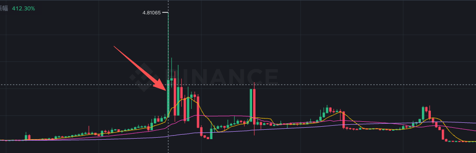

# SIREN/RAVE

> 来源：[Lark Wiki 原文](https://jjp1ynw9z1yy.jp.larksuite.com/wiki/WqNbwItdKihz9lkGdtVjEmB8pAc)
>
> 抓取日期：2026-07-29

siren：

下面按“数据完整性、前置窗口、后置窗口、证据标签、关键地址、Cluster结构、限制”分别列出。

1. 数据完整性
1. 前置窗口指标
历史基准为事件前一周之前的 8 个完整周中位数。

1. 同期与后置指标
1. 信号证据标签
1. 关键地址与资金流
0x0a1f...790d7 在三条链均标记为 is_contract=true，不能当作普通钱包或单一自然人地址。

1. 当前Cluster结构
1. 结论标签
1. 必须保留的限制标签
最终判断不变：SIREN 的 Gate 方向短时归集值得纳入验证指标，但特异性不够；RAVE 没有确认到前置链上信号，确认到的是异动当日后半段至之后的跨链合约归集和持仓重组。
