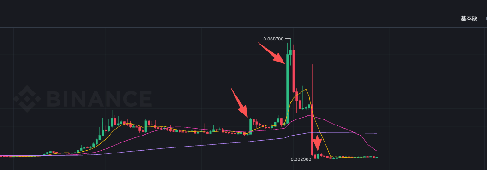

# TAC

> 来源：[Lark Wiki 原文](https://jjp1ynw9z1yy.jp.larksuite.com/wiki/V850wp80tiXcldkKO79jnUdnpxg)
>
> 抓取日期：2026-07-29

#### 执行摘要

#### 数据审计

#### 窗口绝对值

单元格为“笔数 / Token 数量 / 唯一活跃地址”。B28=D-35..D-8，W-2=D-14..D-8，W-1=D-7..D-1。

6/29 的基线包含 6/17，7/9 的基线和 W-2 包含 6/29，因此后两个事件的基线不是完全干净的正常期；这反而使部分倍率更保守。

#### 环比与基线比较

#### 前置结构

“毛转账量”会重复计算来回移动的同一批 Token，不能解释成新增资金或真实成交量。

#### 风险信号矩阵

#### 关键时间线

价格变化数据未提供，下列只能确认 Token 转账。地址标签来源为 Bubblemaps，置信度中；转账本身及哈希置信度高。

#### 关系网络结论

7 月 27 日快照中，BSC 三团占比为 54.02%、21.19%、0.43%；TON 两团为 96.83%、1.90%。TON C1 同时包含 Bybit、Bitget、KuCoin、STON.fi 和大量独立地址。

关键节点中，0:9c3e...676b 当前仅余额 678,490（0.018%），但在 6/29 前净流入 4.258 亿、7/9 前净流出 3.837 亿，更像周转枢纽；0:5175...38bc 当前持有约 8,000 万；Bybit Hot 当前持有约 11.283 亿但属于 Supernode，其完整转账历史缺失。

#### 竞争性假设

#### 最终评级与证据缺口

TAC 当前评级为：6/17 低，6/29 高，7/9 高；不升级为严重。升级需要确认这些转账对应 swap、卖出、撤池或 CEX 成交，并与价格、成交量和市场基准形成时间顺序；若能由交易所库存、桥接、金库或做市记录完整对账，则应降级。
