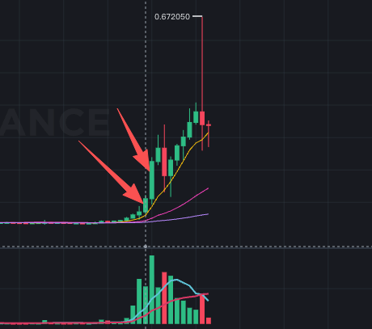

# BANK

> 来源：[Lark Wiki 原文](https://jjp1ynw9z1yy.jp.larksuite.com/wiki/E5TZwBZmHih9HtkL25hjPSJdprf)
>
> 抓取日期：2026-07-29

#### 数据审计

“新增地址”仅表示地址首次出现在本地可见成员历史中，不是钱包创建时间。所有金额均为 BANK 转账总额，同一批币多次转手会被重复计入。

#### 窗口统计

W-2 基数很低，所以 330.46x 会放大异常；但相对前4周周均仍达到 42.15x，异常并不只由低基数造成。

#### 关键时间线

W-1 最大单笔为 5,228,523.53 BANK，哈希：

0x76c8ba28f26f7d8bf25da2546f100ab728edbae64aa6330416a5d95f6de77545

7月19日的8,400万转账占当日总额约 98.999%。剔除后，当日仅剩 849,319.87 BANK，相当于W-1日均的 0.487x。因此D+1的金额爆发基本是单笔事件，不能解释成普遍转账放大。

#### 集中度与关系网络

估算供应量为 1,212,357,692.85 BANK，不是已验证的自由流通量。当前Holder和Cluster只能作为结构背景，不能倒推7月18日前已经保持相同比例。

#### 风险信号矩阵

#### 竞争性假设

#### 结论

BANK在异动前一周存在明确、可复核的异常：转账金额相对前4周周均增加约42倍，并且72.03%的金额集中在同一条五笔归集路径。这足以将其列为高监测优先级前置信号。
