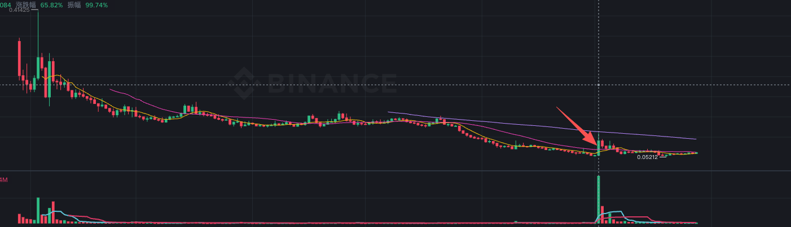

# BIRB

> 来源：[Lark Wiki 原文](https://jjp1ynw9z1yy.jp.larksuite.com/wiki/EPDzwGVpGih2xgkyu6BjjEUqpLe)
>
> 抓取日期：2026-07-29

先区分结论：BIRB 的自动化转账网络信号置信度高，但“这些地址受同一主体控制”尚未确认。

#### 数据审计

#### 窗口统计

异常主要集中在 2026-06-29：当天有1,134条转账、9,263.54万BIRB、716个活跃地址和664个首次可见地址，分别占W-1条目、金额和新增地址的 67.18% / 69.91% / 76.06%。

#### 核心自动化网络

这是本次最强证据：存在大规模的“扇出 → 中间地址 → 归集”结构，而且多数中间地址在极短时间内转出接近全部收到的BIRB。

**已确认事实：**转账顺序、金额和时延真实存在。

**合理推测：**这些地址受到同一自动化流程协调。

**无法确认：**是否同一私钥或实体控制、是否为操盘准备。

#### 关键时间线

#### 当前持仓与Cluster

估算供应量为 999,999,570 BIRB，该分母由Holder的amount/share反推，不是接口明示的自由流通量。

Rank 2明确标记为 Squads Vault "Birb Holdings"；Rank 1仅能确认是无标签合约。最大Cluster还包含交易所、Raydium和其他公共节点，连通不等于共同控制。因为数据是27号获取的，所以新增关系没办法获取。

#### 风险信号矩阵

#### 竞争性假设

#### 结论

BIRB存在比单纯“大额转账”更明确的前置信号：事件前三天形成了大规模、短时、金额高度匹配的扇出与重新归集网络。其自动化和协调执行特征置信度高，可以列为高监测优先级。

但现有结构更接近批量分发、迁移或运营处理，尚不能证明它服务于价格操纵。要升级归因，需要准确的价格异动时刻、Swap与池储备、完整Solana指令、SOL共同gas来源、CEX后续流向以及地址控制证据。
