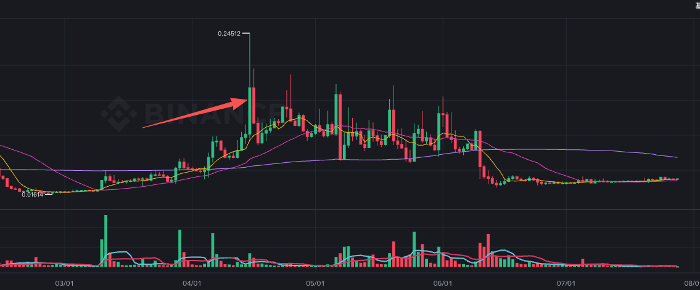

# PLAY  4/15

> 来源：[Lark Wiki 原文](https://jjp1ynw9z1yy.jp.larksuite.com/wiki/F7ndw41oHiTCABkc2Mkjvoucpqh)
>
> 抓取日期：2026-07-29

#### 执行摘要

#### 数据范围

窗口定义：

#### 前窗与基线比较

因此，从完整七天均值看，PLAY 在 04-15 前不存在全面放量前兆。

#### 前窗内部变化

真正值得监控的是 04-12 至 04-14 的局部加速，尤其是 04-14：

- 双链合计 59 条，约为前窗日均的 2.95x。
- 双链合计转账量约 751.13 万，约为前窗日均的 2.88x。
- 但这只是局部短期集中，不是整个 T-7d 窗口持续放量。
#### 关键地址与转账

已确认的结构特征：

#### 事件日表现

Base 是“笔数增加、金额下降”，更像拆分、平台内部调拨或大量小额活动。BSC 则是笔数和金额同时增加，事件日信号主要来自 BSC。

#### 竞争性解释

#### 最终结论

PLAY 在 2026-04-15 前没有持续一周的全面异常放量。比较可靠的信号仅是：

04-12 至 04-14 出现短期活动集中，04-14 双链条目数和转账量同时升高；事件日 BSC 延续金额放大，Base 则主要表现为小额条目增加。
