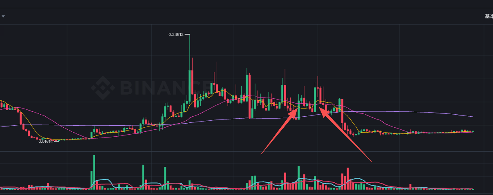

# PLAY

> 来源：[Lark Wiki 原文](https://jjp1ynw9z1yy.jp.larksuite.com/wiki/Np3ow8oA1ibBUdkQQidjxKx4pGg)
>
> 抓取日期：2026-07-29

PLAY需要先拆成两条链、两个事件：

事件为 2026-05-25 和 2026-05-31 UTC。第二次事件的常规前一周包含第一次事件，因此不能当成独立、无污染的基线。

#### 数据审计

两条链均无对应采集错误。原始接口中夹杂的其他代币记录已经按chain + token_address排除。

但语料只覆盖当前Cluster普通成员：Base有36个、BSC有19个Cluster内Supernode无详情，Cluster外Holder也没有独立成员文件。因此结果仍是可见子图下界。

#### 两次事件窗口

Base的W-1确实异常，但金额异常并不等于市场资金普遍放大，需要继续拆分来源。

#### Base核心证据

Base W-1最大两笔均为Gnosis Safe之间的转账：

两笔合计71,483,274 PLAY，占Base W-1金额的 81.21%。剔除后，W-1金额相对四周周均由14.69x降至2.76x。

Base W-1另有明显的交易所地址流量：

W-1共有638条记录触及CEX标签地址，占条目数81.69%，金额占18.32%。两笔Safe转账与CEX标签流量合计相当于W-1金额的 99.54%。

这说明异常主要来自财库或托管地址调度，不是广泛钱包同时进行大额活动。

#### 事件日资金方向

BSC 5月25日的关键哈希为：

0x82c68cf822d6f310ec419834384b38a4a798a888694d4c1de4ea7a07c0b37102

该哈希中的两条PLAY转账合计占BSC当天总额的78.79%，所以当天金额也不是普遍活动放大。

#### 第二次事件判断

5月31日Base相对非常安静的5月28日至30日日均，条目和金额确实反弹约4.39x / 8.63x。但这个反弹有两个问题：

1. 与第一次事件前的活动相比，5月31日只有W-1日均条目的0.54x、金额的0.08x。
1. 当天93.46%的金额来自KuCoin和Kraken热钱包流出。
因此5月31日没有发现一轮新的、独立的强前兆，更像第一次事件后交易所库存或托管钱包的后续调整。BSC链同期同样没有明显信号。

#### 当前持仓和Cluster

两条链的供应量分母不同，缺少桥接和发行机制数据，不能直接相加。

Base Rank 2是销毁地址，持有20%供应量，所以Top5和Cluster占比不能直接解释成“可控筹码”。即使剔除销毁量，Base Rank 1仍约占非销毁供应量的78.27%。

快照采集于7月27日。Base有97/345条当前关系边在5月25日后才首次出现，因此当前Cluster不能作为事件前共同控制证据。

#### 竞争性假设

#### 结论

PLAY不能与BIRB归为同一种高置信度前兆。

- **5月25日：**Base链存在强烈的前置运营异常，但几乎全部可由Safe资金迁移和CEX托管流量解释。市场完整性监测优先级为中，操盘归因置信度低。
- **5月31日：**没有发现新的独立强前兆，Base主要是交易所热钱包流出，BSC活动很弱。
若补充Safe调用解码、项目钱包迁移记录、CEX充值归属、Swap与成交数据、池储备变化和准确价格异动时间，才能判断这些托管调度是否与市场事件存在实质联系。

> 原文证据链接指向作者旧机器上的本地路径，未随 Wiki 导出：Base Safe 转账、Base Kraken 转账、BSC 核心合约转账及 `manifest.json`。

下一份按顺序是 SYN。

## 子文档

- [PLAY  4/15](01-PLAY-4-15.md)
