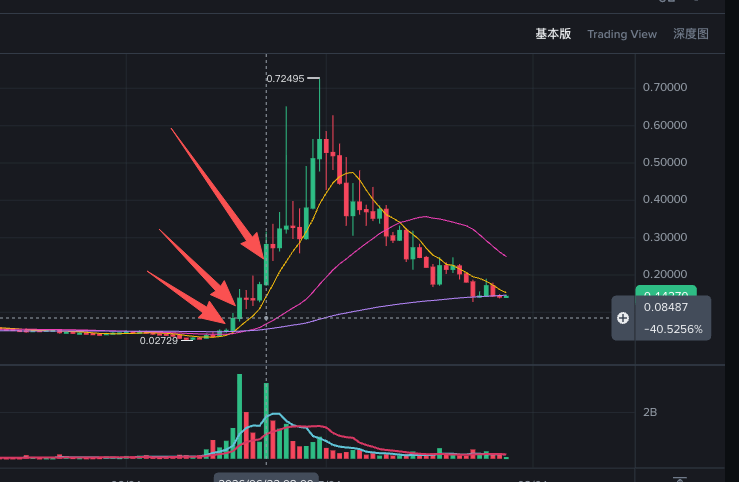

# SYN

> 来源：[Lark Wiki 原文](https://jjp1ynw9z1yy.jp.larksuite.com/wiki/AtFWwXB67ip5v8kUdi7jf0Elpnd)
>
> 抓取日期：2026-07-29

### 执行摘要

最强记录不是典型的资金提前集中：Avalanche 的大额可以闭合为“6月9日分批进入 Safe，6月21日原额转入零地址”；Ethereum 主要是交易所标签地址及中继地址之间的移动。

### 数据完整性

### UTC窗口与相对变化

口径：条目数 / gross SYN。R1=06-10至06-16，E1=06-17至06-18；R2=06-15至06-21，E2=06-22。x 是事件日均值除以参考窗日均值，不是同比。

关键解释：

- BSC 是频次增加的主要来源，但单条中位数由长期参考值约 55.29 SYN 降至 E1 的 44.25、E2 的 18.32，表现为更多小额合约路由。
- Ethereum 的 E1 金额主要被一笔 5,866,860.94 SYN 的 Paribu 冷热钱包转账抬高。
- 6月22日使用自己的即时前7天后，Arbitrum 条数比是 3.89x，不是旧口径的 10.29x。不过 R2 包含前一个事件块，也不能视为纯正常基线。
- 非事件日6月4日已有至少 142 条非Ethereum记录，说明高频并非事件日期独有。
### 关键时间线

### 风险信号矩阵

### 关系网络结论

BSC C1 的 96.68% 中，Gnosis Safe和TokenDistributor当前份额分别为 41.63%、40.97%；Polygon C1的协议Safe单独占 62.19%。这说明 Cluster 集中主要受协议基础设施影响。

Ethereum证据最弱：有详情成员仅覆盖当前份额 27.37%；Top Holder中的Supernode合计 60.62%，且当前关系边约 21.05% 是6月17日之后首次出现。7月27日Cluster不能回填为事件日前关系。

### 竞争性假设

### 风险升降级条件

升级条件：获得准确价格异动时刻后，确认大额记录严格发生在异动前；地址随后调用swap或集中进入交易场所；金额相对池深/自由流通量足以产生影响；多个地址存在共同gas来源或资金最终回流。

降级条件：合约方法和跨链消息证明相关记录属于迁移、铸造、销毁或桥接；Bitvavo/Paribu及BSC路线在非事件期保持相同模式。
