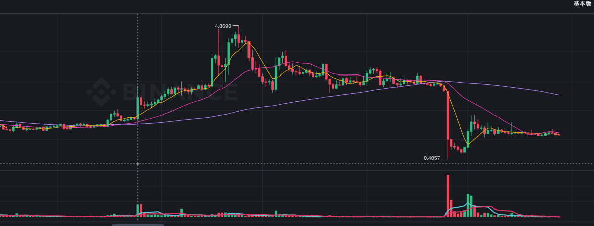

# M (弱)

> 来源：[Lark Wiki 原文](https://jjp1ynw9z1yy.jp.larksuite.com/wiki/SpQpwgvzyivxHHk9JohjGL25pye)
>
> 抓取日期：2026-07-29

#### 执行摘要

当前数据不支持把 M 的 3 月 25 日异动描述为“链上存在明显前兆”。

#### 数据审计

供应量是通过当前 Holder 的 amount/share 反推，并非流通量或自由流通量。

#### 窗口比较

#### 基线倍数

笔数没有下降，但金额大幅下降，说明前窗更多是小额常规转账，而不是大规模资金或代币调动。

#### 前窗逐日变化

03-24 没有出现明确的事件前一天金额放大。明显变化首先出现在事件日，不能作为事前预警。

#### 关键资金路径

T-7d 主要净流：

这更接近 Kraken 地址体系内部的库存迁移。Bubblemaps 标签置信度为中，不能证明这些地址的具体业务用途。

#### 事件日变化

事件日确实出现活动扩张，但绝对规模仍很小。最大单笔仅约占推算供应量的 0.0043%，缺少证据证明其具备显著价格影响能力。

#### 风险信号矩阵

#### 竞争性假设

#### 最终结论

已确认事实： 3 月 25 日事件前一周没有金额放大，主要活动集中在 Kraken 标签地址之间；事件日笔数和金额上升，3 月 26 日又出现一笔 30,000 M 转入 Kraken Hot Wallet。

合理推测： 当前数据更像交易所库存迁移以及市场事件发生后的转账活跃，而不是明确的事前筹备。
