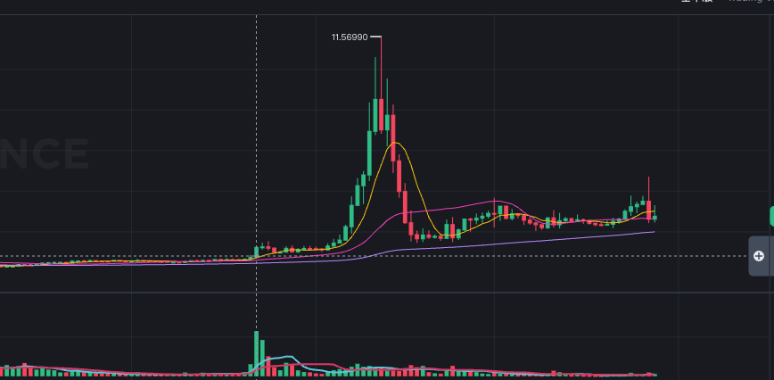

# BEAT (中等)

> 来源：[Lark Wiki 原文](https://jjp1ynw9z1yy.jp.larksuite.com/wiki/F6aQwkQCuilsOlkdoTojWgcXpje)
>
> 抓取日期：2026-07-29

#### 1. 执行摘要

像一次集中的代币分配或平台库存调拨。

#### 2. 数据完整性

38.05% 是 2026-07-27 当前 Cluster 快照，不能直接代表 2026-05-22 时的集中度或共同控制关系。

#### 3. 窗口统计

#### 4. 基线比较

前窗金额只比基线高约14%，但基线受到 05-01 多笔千万级分配抬高。更值得关注的是前窗活动高度集中、参与地址增加及共同来源分发。

#### 5. 前窗逐日情况

这是一个明显的离散序列：

长时间静默 → 05-20 集中分发 → 05-21 再次静默 → 05-22 固定金额重复转账。

#### 6. 05-20 集中分发

已确认的结构：

“当前同团”只证明这些地址在 07-27 的关系图中连通，不证明 05-20 时由同一主体控制。

#### 7. 事件日行为

05-22 共17条转账，其中15条为：

- From：0xa83607c4946047636060db6ba64576d6d1ade88e
- To：0x238a358808379702088667322f80ac48bad5e6c4
- 单笔：固定 1,000 BEAT
- 时间集中于 13:46 UTC 后
- 当日总量：16,930.46 BEAT
示例哈希：

0xa836...e88e 正是 05-20 收到约141.26万 BEAT 的地址之一。但是事件日只转出约1.69万，约占其前期接收量的1.20%，规模较小。

#### 8. 风险信号矩阵

#### 9. 竞争性假设

#### 10. 最终结论

已确认事实： 05-20 出现一次约738.87万 BEAT 的集中分发，其中约597.16万来自 Gate.io Hot Wallet；事件日一个接收地址进行了15次固定1,000 BEAT转账。

合理推测： 这可能是平台提现、做市库存配置或多地址操作准备。它具备“共同来源注资/分发”的形态，但没有后续交易场所流入、Swap或资金回流证据。
