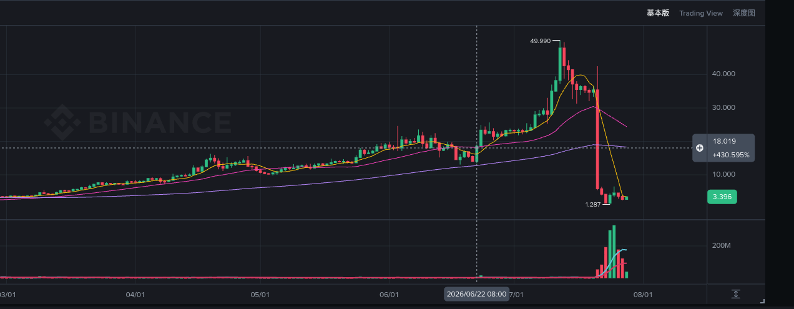

# DEXE(弱)

> 来源：[Lark Wiki 原文](https://jjp1ynw9z1yy.jp.larksuite.com/wiki/UouMw32ioi9JzQkrQABjVnzcpJd)
>
> 抓取日期：2026-07-29

#### 执行摘要

#### 数据完整性

当前最大Cluster占比分别为BSC 65.48%、Ethereum 63.50%，但这是2026-07-27快照，存在明显后见偏差，不能当作事件时集中度。

#### 窗口汇总

双链Token单位相同，可以汇总转账数量；但两条链的供应量不同，供应占比不能直接相加。

#### 分链比较

事件日双链条目达到前窗日均的6.83x，但金额只有前窗日均的0.71x。这是“小额条目增加”，不是资金规模放大。

#### 前窗逐日活动

#### 关键前置转账

06-21的5,392 DEXE约占Ethereum推算供应量0.0056%。时间上接近事件，但规模有限，也没有证据说明它对应卖出或价格影响。

#### 前窗关键主体

已确认存在CEX相关流动，但主要表现为Bithumb、KuCoin钱包收币，不能直接表述为充值后卖出。

#### 事件日行为

BSC事件日33条、总量1,234.80 DEXE，其中主要净流向PancakeSwap的USDT-DEXE池：

- PancakeSwap池净流入：1,144.64 DEXE
- 最大单笔仅100 DEXE
- 最大单笔供应占比：0.00043%
- 主要来源：0xdb59...4ce6和0xb649...0707
Ethereum事件日只有6条、323.67 DEXE。最大单笔134.07 DEXE：

- 时间：2026-06-22 11:04:59 UTC
- 哈希：0xce30e8eba7f62245d3b439865d572a6abef40408ab33839bf8ada71405041a40
BSC向DEX池转入Token可能与Swap或流动性操作有关，但只有Transfer数据，无法确定具体交易方向。

#### 事件后验证

06-23 Ethereum有515.76 DEXE进入Gate.io Hot Wallet，但属于事件后行为，不能反向作为前兆。

#### 风险信号矩阵

#### 最终结论

已确认事实： 事件前一天有5,392 DEXE进入Bithumb Hot Wallet；除此之外，完整T-7d的转账笔数、金额和活跃地址均低于基线。事件日主要是BSC小额转账进入PancakeSwap池。

合理推测： Bithumb入金值得纳入监控，但单独看规模不足，可能只是普通平台充值或库存调拨。
