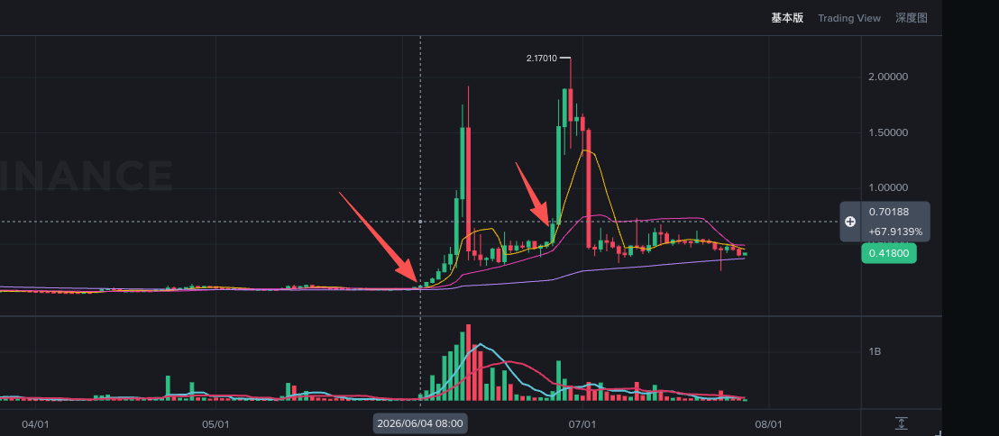

# VELVET(高)

> 来源：[Lark Wiki 原文](https://jjp1ynw9z1yy.jp.larksuite.com/wiki/Bl6EwRCWqihK55kKit0jLS0Xpnr)
>
> 抓取日期：2026-07-29

#### 执行摘要

06-04是目前这组代币中较清晰的链上前置信号之一，但其最合理的正常解释也是明确的：锁仓释放、归属解锁或财库迁移。

---

### 数据覆盖

当前最大Cluster占比为Base 72.33%、BSC 76.28%。这是2026-07-27当前快照，不能直接代表事件时的集中度或共同控制关系。

---

## 事件一：2026-06-04

#### 窗口统计

前窗不是广泛地址活动放大，而是由极少数巨额转账主导。

#### 分链表现

前置信号几乎完全来自BSC。

#### 关键锁仓迁移

2026-06-02，SablierLockup在约7分半内向同一个Gnosis Safe转出三笔：

路径：

SablierLockup 0x6e0b...d395 → Gnosis Safe 0x75e7...94bb

这是锁仓资产进入可操作Safe地址的事实，但“进入Safe”不等于“进入市场”或“准备卖出”。

#### 事件日前后

事件日最大单笔：

- 时间：2026-06-04 02:01:00 UTC
- 路径：KuCoin Hot → KuCoin Cold
- 数量：187,587.49 VELVET
- 哈希：0xcdc79ca24b83cd294d8408895d09285626df7b955ce53f8cdeff8ff8ebd65ab0
事件后06-05出现：

- 0xae86...f8ce → Kraken 0x25fc...711d
- 数量：4,999,900 VELVET
- 哈希：0xa8dbe6e0a416a2186508edf5dc413306fcc3aa919337fdfe5b1595d8e53a676f
但是当前数据没有证明0xae86...f8ce与接收锁仓资产的Gnosis Safe存在连接，因此不能把这500万视为锁仓资产直接进入Kraken。

#### 06-04风险判断

06-04结论： 前置监控信号强，主要是大规模锁仓资产可用化；但正常解锁解释同样强，操纵归因置信度低。

---

## 事件二：2026-06-26

#### 基线污染说明

06-26的标准基线为05-22至06-18，包含：

- 06-04事件；
- 06-04前的5,120.86万锁仓迁移；
- 06-05约500万Kraken入金；
- 事件后一周的较高活动。
因此标准基线金额被严重抬高，不能直接把前窗0.057x解释为异常消失。

辅助比较结果：

无论采用哪套参考，06-26前都没有整体金额放大。

#### 06-26前窗分链

#### Base前置信号

Base最大单笔发生于06-24：

- 时间：2026-06-24 11:29:29 UTC
- 路径：veVELVET 0x355a...f927 → 0x6fd9...72ca
- 数量：35,901.11 VELVET
- 占Base推算供应量：0.4546%
- 哈希：0x152b536fb84c605a2556726cbaef2d7eec8c9511c279c6462d0136b2874d49b5
Base前窗其他结构：

veVELVET和Aerodrome相关活动具有一定市场结构意义，但没有Swap方向、池深或锁仓操作类型，不能判断是买入、卖出、解锁还是流动性调整。

#### BSC平台路径

BSC前窗累计：

Gate Deposit流入值得监控，但总量只约占BSC推算供应量0.0173%，且Bubblemaps标签只有中等置信度。

#### 事件日与事件后

事件日最大BSC单笔仍为KuCoin Hot → Cold，73,804.21 VELVET。06-27相同路径增加至166,421.08 VELVET，说明KuCoin钱包迁移持续，但不能据此判断市场方向。

#### 06-26风险判断

#### 最终结论
