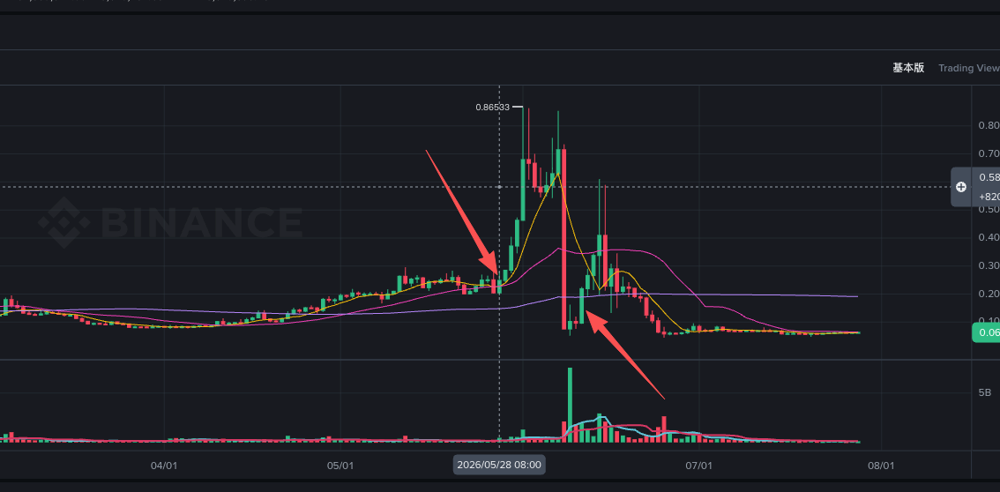

# H(弱)

> 来源：[Lark Wiki 原文](https://jjp1ynw9z1yy.jp.larksuite.com/wiki/STg5wkZhpiUWHbkXIQfjU1Odpve)
>
> 抓取日期：2026-07-29

#### 执行摘要

这里不能把结果写成“前窗0条，所以风险低”。因为这不是完整历史中的零活动，而是目标Token当时尚无可见链上转账数据。

#### 映射核对

数据库修复SQL、本地采集目标及Manifest均指向同一个目标：

因此当前没有发现“漏分析了另一条链”的证据。

#### 两个事件的覆盖情况

最早数据时间比06-11事件晚约5天，比05-28事件晚约19天。

#### 最早链上记录

本地第一条记录是从零地址铸造：

随后发生初始分配：

这说明至少在当前数据中，H的Token流通记录从06-16铸造开始。它进一步降低了用该合约解释05-28和06-11市场异动的合理性。

#### 可能的解释

#### 最终结论

已确认事实： 当前映射下，H最早可见记录是2026-06-16从零地址铸造约100亿Token。05-28和06-11的基线、前窗及事件日均早于这一时间。

合理推测： 这两个时间可能对应盘前产品、另一个同名Token，或者事件日期存在偏差。
