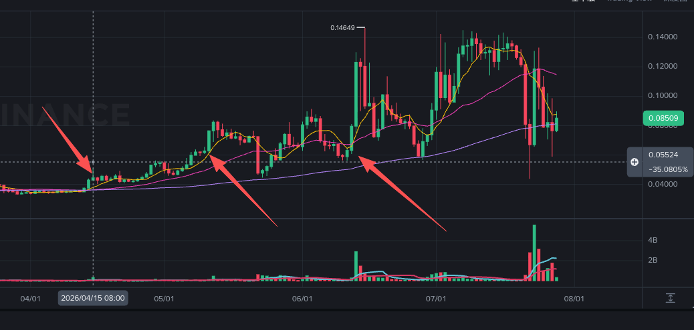

# RIF(低)

> 来源：[Lark Wiki 原文](https://jjp1ynw9z1yy.jp.larksuite.com/wiki/B5dcwdtwiiCRhDkPvUCjVIx2ptd)
>
> 抓取日期：2026-07-29

#### 执行摘要

RIF不能按正常代币报告输出“低风险”。当前采集数据更像少量跨链包装资产或边缘持仓，并不能代表RIFUSDT对应的主要Token市场。

#### 分链覆盖

这些链的推算供应量只有几十至数千枚，与通常能够代表交易对市场的Token规模明显不匹配。这里只能确认当前地址集合覆盖很小，不能断言数据库合约一定错误。

#### 事件覆盖审计

前两个事件的零值不能解释为“链上静默”，因为四链覆盖本身不具代表性。

#### Ethereum全部相关活动概况

Ethereum在三个事件附近只有两条较接近的记录：

06-13事件日证据：

- 哈希：0x3ab9a470b9a83f92bfc7aba37e94304ba62485c14fc9f8490e8515da46448bfa
- 数量：19.757 RIF
- 发送方：0xf3d2d0559e9e9aa3c82c34801755809dbf9c86f9
- 接收方：0x8f10b468b06c6fd214b65f87778827f7d113f996
虽然19.757枚约占当前Ethereum包装供应估计的1.06%，但这个分母只有约1,864枚，不能用来评估RIFUSDT市场影响能力。

#### 数据为什么不能用于本次分析

#### 竞争性解释

#### 最终结论

已确认事实： 当前RIF四链数据无法覆盖主要市场活动。04-15和05-12没有可用样本；06-13只有一条19.757 RIF的事件日转账，前窗为零。

合理推测： 当前地址可能只是包装资产或边缘跨链版本，未覆盖RIFUSDT实际主要流通网络。
