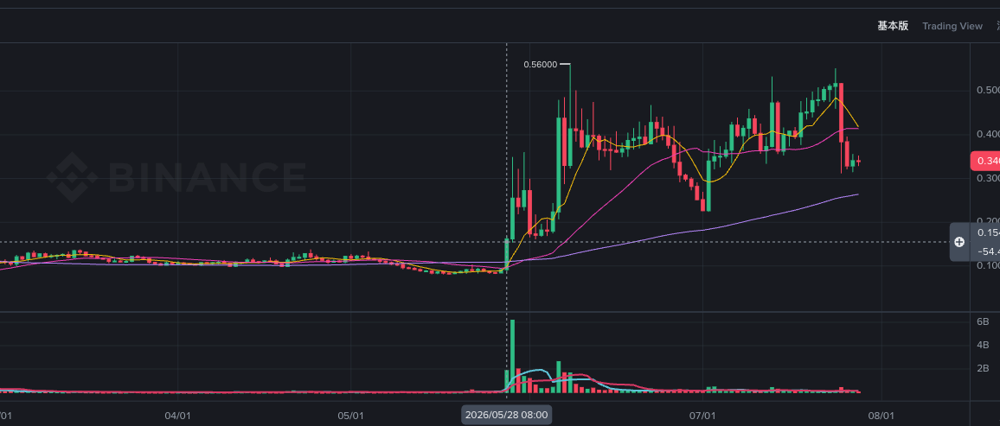

# ALLO（中）

> 来源：[Lark Wiki 原文](https://jjp1ynw9z1yy.jp.larksuite.com/wiki/Fsjkw1XdwiSBm4kldwujgLVxpBg)
>
> 抓取日期：2026-07-29

#### 执行摘要

本地数据没有覆盖 2025 年同期，因此不能计算严格意义上的“同比”。下面使用 28 日基线比和周环比，不把它们误称为同比。

#### 数据审计

#### 窗口统计

表格单元格格式：转账条目 / Amount / 日均活跃地址。

BSC 的倍数很高，但绝对金额只有 1,840.81 ALLO，占该链推算供应量 0.00977%，不具备强解释力。ETH 前一周占推算供应量 2.7135%，但这是转账流量，同一批代币可能被重复转移。

#### 关键时间线

#### 风险信号矩阵

#### 竞争性假设

#### 最终判断

ALLO 在 5 月 28 日之前存在可监控但不够强的链上变化。最值得关注的是 ETH 前一周 179.93 万 ALLO 的流转和 49.26 万的最大单笔；但长期基线、资金路径和地址结构均不支持把它升级为高风险前兆。
