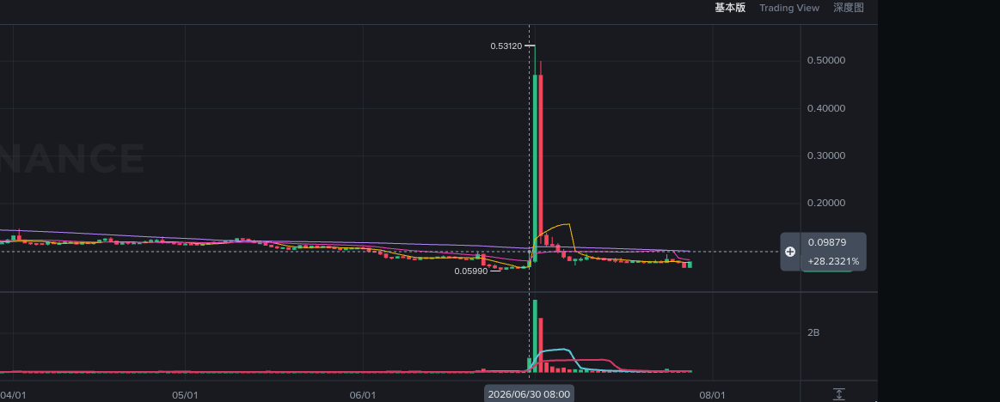

# TAIKO(中)

> 来源：[Lark Wiki 原文](https://jjp1ynw9z1yy.jp.larksuite.com/wiki/KfZlwx3AdivAdIkLazqjJlDjp3r)
>
> 抓取日期：2026-07-29

#### 执行摘要

#### 数据审计

两条链均未发现异币、异链或解析失败记录。本地目标清单只包含 BSC、ETH，因此只能确认这两条链采集成功，不能证明现实中的全部部署链已经覆盖。

供应量由 amount/share 反推，不是流通量或自由流通量。事件只有日期，没有具体时刻，无法严谨计算 T-1h 和滚动 T-24h。

#### 窗口统计

单元格格式：转账条目（唯一哈希）/ Amount / 日均活跃地址。

ETH 的 T-7d 低于基线内所有滚动七日安慰剂窗口。BSC 只略高于长期日均，却显著低于紧邻前周，因此不存在持续升温序列。

#### 关键时间线

#### 主要前置条目判断

971,128 TAIKO 的单笔规模位于基线约第 97.8 百分位，但基线中仍有13条更大记录，同一 Safe 在6月9日也曾转出140.54万，因此它不是异常孤例。

接收方 0x6e30...b4ff 曾在2025年收到另一个 Taiko Safe 标签地址转入的600万 TAIKO，较符合项目分配、财务或托管路径这一替代解释。不过，这只能证明历史转账关系，不能证明共同控制。

现有文件没有该接收方后续转出记录，但不能据此认定其一直持有：它不在7月27日 Holder/Cluster 成员中，脚本没有采集它的完整地址历史。

#### 风险信号矩阵

#### 竞争性假设

#### 最终结论

TAIKO 在6月30日前没有形成可复用的高强度预警序列。唯一需要关注的是97.11万 TAIKO 的 Safe 转账，但它在该地址历史行为中并不突出，接收方去向又无法从当前采集范围继续验证。
